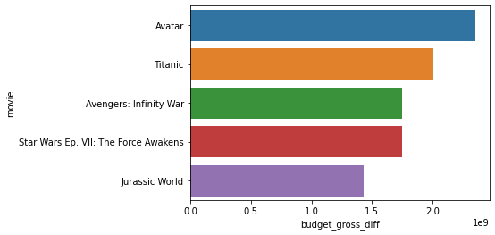

# Readme

**The format for the readme should be as follows**:

* **Goals and Objectives**:
    Briefly describe the goal of the project and the datasets you had access to. 

* **For each question**:
    1. Describe the EDA done to get the data, include any table joins performed and any sort of cleaning.
    2. Note down any findings/recommendations/future work you may have

* Command to convert jupyter notebook to markdown file:
    ```jupyter nbconvert --to markdown notebookname.ipynb```
    
* Resources on markdown syntax in jupyter notebook: 
    1. https://medium.com/ibm-data-science-experience/markdown-for-jupyter-notebooks-cheatsheet-386c05aeebed
    2. https://www.earthdatascience.org/courses/intro-to-earth-data-science/file-formats/use-text-files/format-text-with-markdown-jupyter-notebook/

# Most profitable films

For exploring this particular thing, I looked at the file ```tn_movie_budgets_gz```. The next step involved was to find the difference between the ```worldwide_gross``` column and the ```production_budget``` column for the entire data. I then sorted the data by the newly created Profit/Loss column and in the interest of keeping my visualization easy to interpret, I only looked at the top 5 films. Here is my resulting visualization




```python

```
